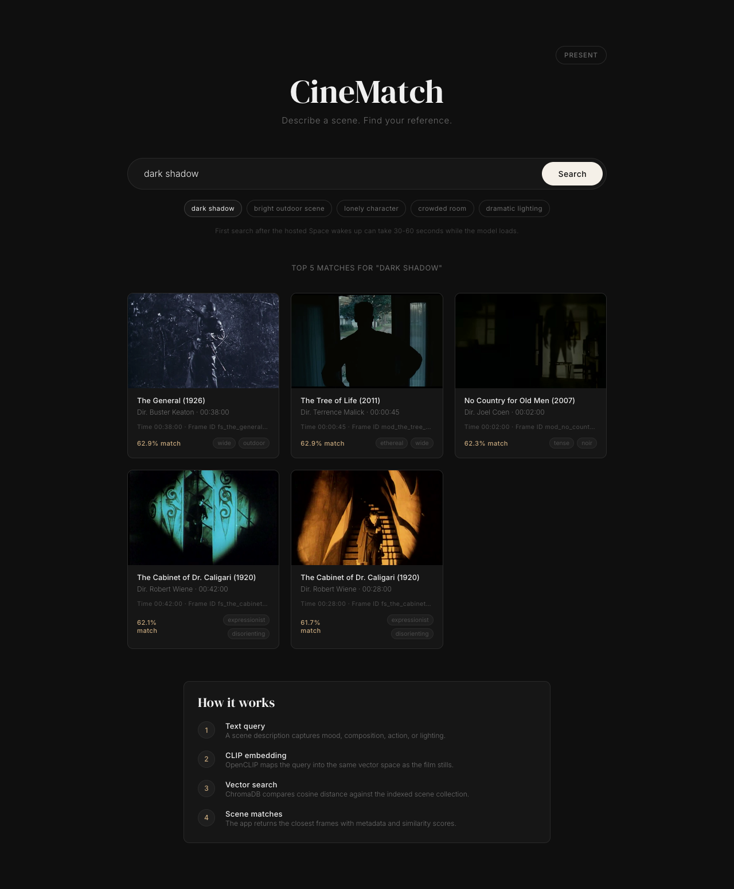
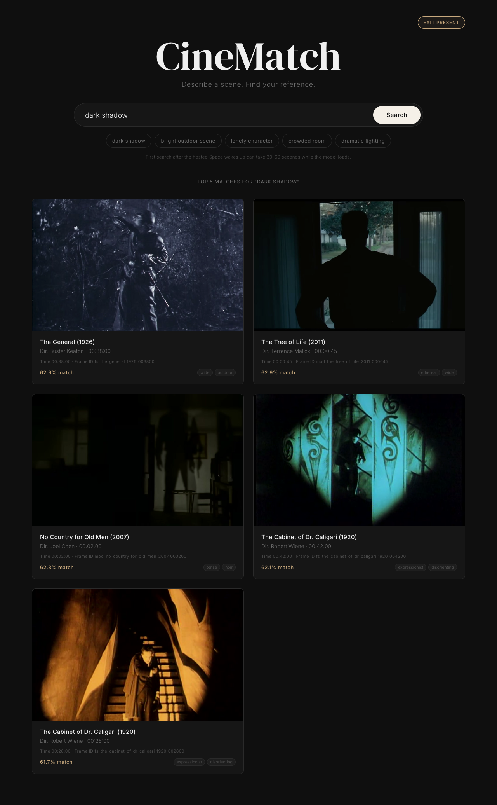
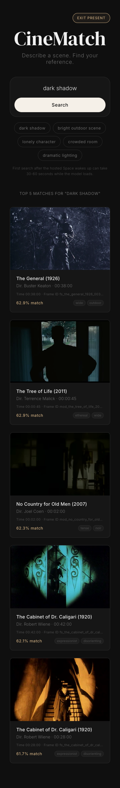

# CineMatch — Natural Language Film Scene Retrieval

CineMatch is a web application that allows filmmakers to describe a scene they want to shoot in natural language and retrieves visually and tonally matching reference scenes from a curated dataset.

## How It Works

CineMatch uses **CLIP** (Contrastive Language-Image Pre-Training) to bridge the gap between textual scene descriptions and visual film stills. Both images and text are projected into a shared 512-dimensional embedding space, enabling direct comparison via cosine similarity.

1. **Ingestion**: On setup, all scene images are encoded with CLIP's vision encoder (ViT-B/32) and stored in a ChromaDB vector database alongside metadata (source, description, tone tags).
2. **Query**: The user types a natural language description (e.g., *"a quiet dinner where something is being left unsaid"*).
3. **Encoding**: The query is encoded with CLIP's text encoder into the same embedding space.
4. **Retrieval**: ChromaDB returns the top 5 scenes with the highest cosine similarity to the query.
5. **Display**: Results are shown as image cards with source attribution and a similarity score.

## Academic Foundation

This project implements the retrieval methodology described in:

> Radford, A., Kim, J.W., Hallacy, C., et al. (2021). **"Learning Transferable Visual Models From Natural Language Supervision."** *Proceedings of the 38th International Conference on Machine Learning (ICML).*

The key insight from Radford et al. is that contrastive pre-training on large-scale image-text pairs produces a shared embedding space where semantic similarity between modalities can be measured directly with cosine similarity — enabling zero-shot transfer to downstream retrieval tasks without task-specific fine-tuning.

## Dataset

The dataset consists of 30+ curated images sourced from:

- **Wikimedia Commons** — public domain film stills
- **The Internet Archive** (archive.org) — public domain films
- **Pixabay / Unsplash** — cinematic stills with film-like qualities

Images span a diverse range of tones and visual styles: dark/moody, bright/hopeful, tense/claustrophobic, wide/epic, intimate/close, noir, ethereal, and more.

## Setup & Running

### Prerequisites

- Python 3.10+
- pip

### Installation

```bash
cd cinematch
pip install -r requirements.txt
```

### Prepare the Dataset

Place your scene images in `data/scenes/` with filenames matching those in `data/metadata.json`. Then run the ingestion script to encode all images and populate ChromaDB:

```bash
python -m backend.ingest
```

### Start the Server

```bash
uvicorn backend.main:app --reload --port 8000
```

Open [http://localhost:8000](http://localhost:8000) in your browser.

Last deploy workflow smoke test: 2026-04-20.

## Class Presentation Demo

The frontend includes a presentation-ready demo surface:

- Preset queries: `dark shadow`, `bright outdoor scene`, `lonely character`, `crowded room`, and `dramatic lighting`
- Presenter mode: click **Present** or open [http://localhost:8000/?present=1](http://localhost:8000/?present=1)
- Cold-start note: the UI sets expectations when the hosted Space is waking up
- Result metadata: each match shows title, director, timestamp, frame ID, tone tags, and similarity score
- In-app explanation: the lower panel summarizes the CLIP-to-ChromaDB retrieval pipeline

Suggested live flow:

1. Open presenter mode.
2. Click `dark shadow` to show semantic matching from a short query.
3. Open one result and explain the metadata, tone tags, and similarity score.
4. Type a more specific prompt, such as `a lonely figure framed by harsh light`, to show natural-language retrieval.

Fallback screenshots for class Wi-Fi or Space startup delays:







## Free Hosted Demo

For a free public link, deploy this project as a Docker Space on Hugging Face Spaces.
This is a better fit than Vercel because CineMatch runs a Python ML backend with
PyTorch, CLIP, and ChromaDB.

### Hugging Face Spaces

1. Create a free account at [huggingface.co](https://huggingface.co/).
2. Create a new Space:
   - Space SDK: `Docker`
   - Visibility: `Public`
   - Hardware: `CPU basic`
3. Upload or push the contents of this `cinematch/` folder to the Space.
4. Wait for the Space to build.
5. Share the Space URL with your professor.

The first search after startup can be slow because the CLIP model has to load.
After that, searches should be faster.

## API

- `GET /api/search?q=<query>` — Returns top 5 matching scenes for the given natural language query.
- `GET /api/status` — Returns the number of scenes currently indexed.

## Project Structure

```
cinematch/
  backend/
    main.py         # FastAPI app and query endpoint
    embedder.py     # CLIP encoding logic (with academic citation)
    database.py     # ChromaDB setup and ingestion
    ingest.py       # Script to preload the dataset
  frontend/
    index.html
    style.css
    app.js
  data/
    scenes/         # Image files
    metadata.json   # Scene metadata (source, description, tone tags)
  requirements.txt
  README.md
```

## Evaluation

Performance of CineMatch would be evaluated through **user judgment studies**:

1. **Relevance Rating**: Present users with a query and the returned results, then ask them to rate (1–5) how well each result matches the mood, composition, and visual intent of the prompt.
2. **Comparative Ranking**: Show users results from CineMatch alongside results from keyword-based search and ask which set better captures the described scene.
3. **Precision@K**: Measure what fraction of the top-K results a panel of filmmakers considers genuinely relevant to the query.

Because scene-to-description matching is inherently subjective (different filmmakers may interpret "a quiet dinner where something is being left unsaid" differently), quantitative metrics like precision and recall must be complemented by qualitative assessment of whether the retrieved scenes serve as useful creative references.

### Presentation Snapshot

- Indexed scenes: **172**
- Encoder: **OpenCLIP ViT-B/32**
- Vector store: **ChromaDB**
- Similarity metric: **cosine similarity**
- Returned results: **top 5 scene matches**
- Demo queries: `dark shadow`, `bright outdoor scene`, `lonely character`, `crowded room`, `dramatic lighting`
